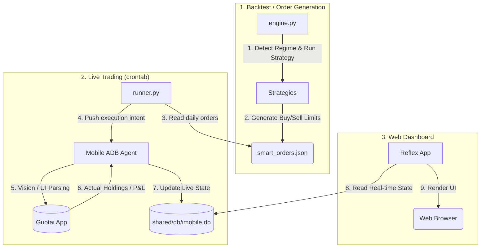

# iMobile Architecture

> A-Shares automated trading system: quantitative backtesting, live trading automation, and reflex web dashboard.

## Project Overview

iMobile is organized into 3 interconnected subsystems:

1. **Backtest** — `backtest/` — quantitative research engine and order generator
2. **Trading** — `trading/` — live trading orchestrator & mobile ADB automation agent
3. **Web** — `web/` — Reflex-based real-time portfolio dashboard

Shared databases, caches, and utilities are located in the `shared/` and `utils/` directories.

---

## Directory Map

```text
imobile/
├── backtest/                     # [1] Backtest & Order Engine
│   ├── engine.py                 #   Main orchestrator: pick → orders → execute
│   ├── strategies/               #   Stock selection logic (ts_auto, ts_7AZ, ts_dc, etc.)
│   ├── core/                     #   A-Shares rule enforcement (T+1), order execution
│   ├── data/                     #   Data providers (Tushare, Akshare, SQLite cache)
│   ├── utils/                    #   Market regime detection, calendars
│   ├── analysis/                 #   Post-backtest performance metrics & charts
│   ├── config.json               #   Risk parameters, regime TP/SL thresholds
│   └── results/                  #   Backtest reports (YYYYMMDD_YYYYMMDD_ts_XX/)
│       └── daily/                #   Daily trading output (pick + smart orders)
│
├── trading/                      # [2] Live Trading & Automation
│   ├── runner.py                 #   Live scheduler (pre-market, market, post-market)
│   ├── guotai.py                 #   ADB + Gemini Vision automation for Guotai App
│   ├── adb.py                    #   Android emulator bridge and commands
│   └── db_sync.py                #   Syncs parsed mobile UI data into imobile.db
│
├── web/                          # [3] Reflex Web Dashboard
│   ├── rxconfig.py               #   Reflex configuration and Tailwind/Radix plugins
│   ├── app/                      #   Reflex Application
│   │   ├── app.py                #     Route definitions
│   │   ├── pages/                #     /portfolio, /sector-history
│   │   ├── components/           #     UI Elements (stock_table, market_stats)
│   │   ├── states/               #     WebSocket state management (PortfolioState)
│   │   ├── api.py                #     FastAPI endpoints for serving dynamic reports
│   │   └── db.py                 #     SQLModel schema matching imobile.db
│   └── assets/                   #   Static assets and dynamically symlinked reports
│
├── shared/                       # Shared Resources
│   ├── db/                       #   imobile.db (Live state) and db_cache.db (Market Data)
│   └── data/                     #   Saved strategy outputs
│
├── utils/                        # Cross-Module Utilities
│   ├── daily_stock_analysis/     #   LLM-powered fundamental analysis
│   ├── searxng/                  #   Local search integration
│   └── result_backtest.py        #   Aggregated backtest monthly reporter
```

---

## High-Level Data Flow

The three subsystems interact primarily through the shared SQLite database (`shared/db/imobile.db`) and file-based handoffs.



---

## Subsystem Deep Dives

### 1. Backtest Engine (`backtest/`)

The backtest engine simulates A-Share market conditions perfectly (T+1, limits, fees) and also serves as the *Order Generator* for live trading.

**Core Workflow:**
1. **Regime Detection:** `detect_market_regime()` uses 120-day MA60/MA120 to classify the market as Bull, Bear, Normal, or Volatile.
2. **Strategy:** Default `ts_7AZ` runs CANSLIM 7-factor screening. `ts_auto` is available as a meta-strategy that delegates to sub-strategies.
3. **Smart Orders:** `create_smart_orders_from_picks()` generates dynamic `buy_price`, `take_profit`, and `stop_loss` levels with regime-based ratios (TP: Bull 25%, Normal 15%, Volatile 10%, Bear 8%). SL uses narrow trailing buffer (Bull 5%, Normal 4%, Volatile 3%, Bear 2%) — resets to `current_price × (1 - buffer%)` on re-pick, creating a fail-fast dynamic that cuts losers early while avoiding noise on normal volatility.
4. **Execution / Validation:** `TradeValidator` ensures no short selling and enforces T+1 settlement holding constraints.

### 2. Live Trading Automation (`trading/`)

Because automated API trading for retail A-Share accounts is heavily restricted, iMobile uses an intelligent **UI Automation Agent**.

**Execution Phases (`runner.py`):**
- `pre-market` (09:10): Calls `backtest/engine.py` to generate today's smart orders and writes to `suggestion_stocks` DB table.
- `market` (09:30-15:00): Instructs the mobile agent to enter orders based on real-time price checks.
- `post-market` (15:10): Agent performs a full UI traversal of the broker app to parse actual account balances, holdings, and P&L.

**Mobile Agent (`guotai.py`):**
- Uses `adb.py` to launch the Android emulator and tap coordinates.
- Uses `Gemini Vision` (via `DroidRun`) to take screenshots, understand the app's current UI state, extract financial numbers via OCR, and recover from unexpected popups or app updates.

### 3. Web Dashboard (`web/`)

A presentation layer built with Reflex (Python to React compiler). It reads directly from the shared `imobile.db`.

**State Management (`PortfolioState`):**
- Queries the `summary_account` and `holding_stocks` tables using SQLAlchemy.
- Updates the UI dynamically when the underlying database is modified by the trading agent.

**Pages:**
- `/portfolio`: Real-time tracking of the portfolio synced from the broker app.
- `/sector-history`: Interactive analytical tool merging Tushare historical data and Dongfang Caifu (DC) real-time data to identify hot sector rotation. Uses Plotly for rendering interactive candlestick + MACD charts.

---

## Configuration & Parameters

The central brain of the quantitative risk model lives in `backtest/config.json`. This config dictates behavior across all regimes.

```json
{
  "init_info": { "initial_cash": 600000, "max_positions": 6 },
  "trading_rules": {
    "risk_reward_ratios": {
      "bull_market":    { "take_profit_pct": 0.55, "stop_loss_pct": 0.03 },
      "bear_market":    { "take_profit_pct": 0.12, "stop_loss_pct": 0.05 },
      "volatile_market": { "take_profit_pct": 0.22, "stop_loss_pct": 0.04 },
      "normal_market":  { "take_profit_pct": 0.22, "stop_loss_pct": 0.06 }
    }
  }
}
```

## Key Design Principles

1. **T+1 Compliance** — Modeled correctly across both backtesting and live environments.
2. **No Lookahead Bias** — Strategies are restricted from using current-day closing data to generate current-day open orders.
3. **Resilient Automation** — The ADB agent relies on LLM vision rather than hardcoded coordinates for data extraction, making it robust against broker app UI changes.
4. **Single Source of Truth** — `imobile.db` holds the definitive state of the live portfolio, bridging the Python backend and the Reflex frontend.
