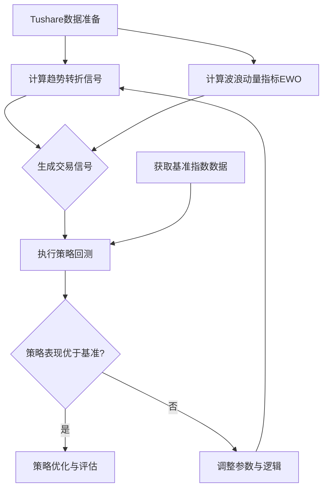

# Python与Tushare API，通过“趋势转折信号”和“波浪动量指标”来构建一个能跑赢大盘指数的策略

## 策略的构建过程流程图:



## Steps

### Stock Data and Config

Refer to the configuration and usage of the Tushare API in the backtest/ directory or fetch [Tushare API](https://tushare.pro/document/2?doc_id=27) by context7 MCP.


### 🔍 理解并计算核心指标

获取数据后，下一步是计算你提到的两个核心指标。

#### 趋势转折信号 (Cover Buy Sell)

这个信号通常用于识别**趋势的潜在反转点**，例如在下跌趋势结束时买入，在上涨趋势结束时卖出。实现思路如下：

*   **识别基础趋势**：你可以结合**均线系统**和**价格高低点比较**来判断。
    *   **均线系统**：例如，使用**50日简单移动平均线(SMA)** 和**200日SMA**的关系来判断长期趋势。当50日SMA大于200日SMA时，可能处于牛市或“积累阶段”。
    *   **价格行为**：通过比较当前K线的高点/低点与前期的高点/低点，可以辅助判断趋势的强弱。例如，连续三日创新高且低点抬高，可能意味着“价格强势”。
*   **寻找转折信号**：
    *   **背离分析**：“变盘电波”指标的原理是基于MACD的**顶背离和底背离**。顶背离通常指价格创新高而指标未创新高，是潜在的反转信号。
    *   **结合成交量**：**“生命线(成交量)”** 指标指出，当出现一根量能远超前期（例如一倍以上）的成交量柱时，可能意味着短期内的变盘。

#### 波浪动量指标 (EWO)

EWO(Elder Wave Index) 由Alexander Elder博士提出，它通过计算两根不同周期的移动平均线的差值，来衡量价格动量的强弱。计算和使用方法如下：

*   **计算方法**：EWO = 快速移动平均线(例如**5日或13日EMA**) - 慢速移动平均线(例如**35日EMA**)
    ```python
    # 计算EWO指标的示例
    df['ema_fast'] = df['close'].ewm(span=5, adjust=False).mean()  # 5日EMA
    df['ema_slow'] = df['close'].ewm(span=35, adjust=False).mean() # 35日EMA
    df['ewo'] = df['ema_fast'] - df['ema_slow']
    ```
*   **使用技巧**：
    *   当EWO从负值区域上穿零轴时，可视为**买入信号**。
    *   当EWO从正值区域下穿零轴时，可视为**卖出信号**。
    *   你也可以观察EWO线与价格之间的**背离现象**，来寻找趋势反转的线索。

### ⚙️ 整合交易策略与回测

有了指标之后，你需要将它们结合起来，形成明确的交易规则，并进行回测。

1.  **生成交易信号**：综合两个指标来定义清晰的买卖点。
    *   **买入信号**：趋势转折信号发出**看涨背离**（例如价格新低但指标未新低），同时EWO指标**由负转正或强势上扬**。
    *   **卖出信号**：趋势转折信号发出**看跌背离**（例如价格新高但指标未新高），同时EWO指标**由正转负或急剧下滑**。

2.  **执行策略回测**：你需要编写回测代码来模拟历史交易，核心是计算策略的累计收益率、年化收益、夏普比率、最大回撤等，并与基准指数（如沪深300）进行比较。
    *   **初始资金**：例如600,000元。
    *   **交易规则**：严格按照生成的信号进行买卖，每次交易都计算仓位价值。
    *   **绩效对比**：将你的策略收益曲线与沪深300等指数的收益曲线放在一起对比，直观判断是否跑赢。

### 🛠️ 策略优化, 注意事项 and Next Steps

初步回测后，往往还需要优化和注意以下问题：

*   **参数优化与过拟合风险**：移动平均线的周期、EWO的快慢线参数等都可能影响结果。你需要避免在历史数据上过度优化，导致策略在未来失效。
*   **风险管理**：任何策略都不是100%成功的。
    *   可以考虑设置**止损位**，例如，当亏损达到某个百分比（如-8%）时平仓。
    *   使用**“趋势九转序列”** 等指标作为辅助过滤工具，在序列形成“下跌9”时谨慎买入，出现“上涨9”时警惕卖出。
*   **综合研判**：不要孤立使用一两个指标。可以结合**“机构资金线”**或**盘口Tick数据**等其他信息进行综合判断。

### 🛠️ 回测 CLI 调优小贴士

运行 `python backtest_cbs_ewo.py` 时可以利用下列辅助参数：

* `--buy-mode {strict,relaxed}`：`strict`（默认）要求“趋势转折信号”和“零轴上穿”同时出现才建仓，`relaxed` 只要任一信号触发即可，适合想提高交易频率的场景。
* `--show-signal-counts`：在模拟前输出每个交易日的买卖信号数量，便于快速诊断为什么策略当日没有操作。

* 严谨的回测以及持续的迭代优化。
